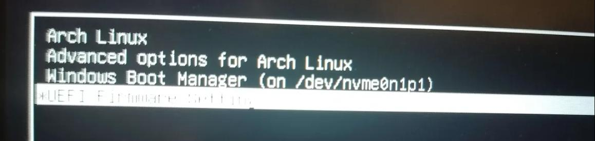
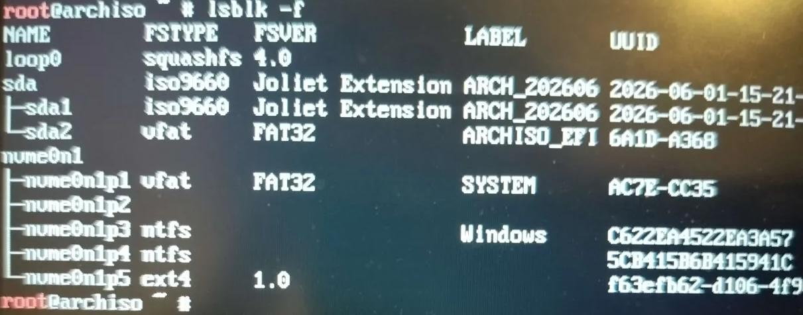
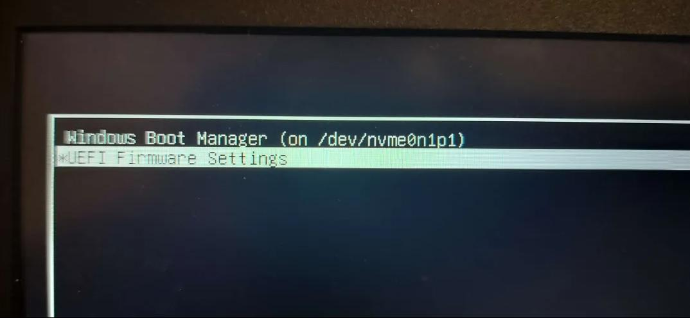
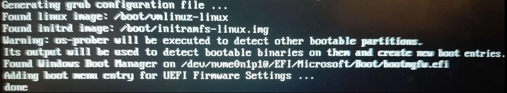
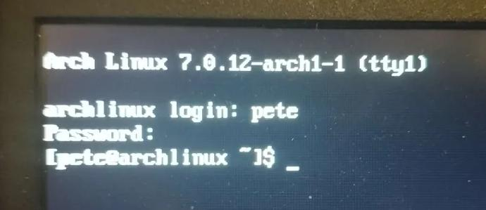

# Arch Linux dual boot -asennus Windows 11:n rinnalle

Tässä projektissa asensin Arch Linuxin manuaalisesti Windows 11:n rinnalle samalle kannettavalle tietokoneelle. Tavoitteena oli rakentaa toimiva dual boot -ympäristö siten, että Windowsin olemassa olevat osiot ja tiedostot säilyvät käytettävissä.

Lopputuloksena koneen käynnistyessä avautuu GRUB-valikko, josta voidaan valita joko Arch Linux tai Windows Boot Manager.



## Lopputulos

- Arch Linux käynnistyy onnistuneesti.
- Windows 11 säilyi toimivana.
- GRUB tunnistaa molemmat käyttöjärjestelmät.
- Arch Linuxille luotiin oma `ext4`-osio.
- Molemmat käyttöjärjestelmät käyttävät samaa UEFI/EFI-käynnistysrakennetta.
- Arch Linuxin verkkoyhteys, käyttäjätili ja järjestelmäpäivitykset testattiin.

## Käytetyt teknologiat ja työkalut

- Arch Linux
- Windows 11
- UEFI/EFI
- GRUB
- Rufus
- `iwctl`
- NetworkManager
- `pacman`
- Linuxin komentorivi

## Projektin työvaiheet

### 1. Asennusmedian valmistelu

Arch Linuxin asennusmedia luotiin USB-tikulle Rufuksella. Secure Boot poistettiin käytöstä BIOS/UEFI-asetuksista, jotta asennusmedia käynnistyi onnistuneesti UEFI-tilassa.

UEFI-tila tarkistettiin komennolla:

```bash
cat /sys/firmware/efi/fw_platform_size
```

Tuloste `64` vahvisti, että asennusmedia oli käynnistynyt 64-bittisessä UEFI-tilassa.

### 2. Verkkoyhteyden muodostaminen

Wi-Fi-yhteys muodostettiin Arch-asennusympäristössä `iwctl`-työkalulla. Yhteyden toiminta testattiin lähettämällä kolme testipakettia:

```bash
ping -c 3 archlinux.org
```

### 3. Levyjen ja osioiden hallinta

Levyjen ja tiedostojärjestelmien rakenne tarkistettiin komennolla:

```bash
lsblk -f
```

Windowsin osioita ei poistettu tai formatoitu. Arch Linuxille luotiin oma osio `/dev/nvme0n1p5`, joka formatoitiin `ext4`-tiedostojärjestelmään.



Arch Linuxin osio ja olemassa oleva EFI-osio liitettiin asennusta varten:

```bash
mount /dev/nvme0n1p5 /mnt
mkdir -p /mnt/efi
mount /dev/nvme0n1p1 /mnt/efi
```

### 4. Perusjärjestelmän asennus

Arch Linuxin perusjärjestelmä, kernel, laiteohjelmistot, tekstieditori ja verkkoyhteyksien hallinta asennettiin `pacstrap`-komennolla:

```bash
pacstrap -K /mnt base linux linux-firmware nano networkmanager
```

Tämän jälkeen luotiin `fstab` ja siirryttiin asennettuun järjestelmään:

```bash
genfstab -U /mnt >> /mnt/etc/fstab
arch-chroot /mnt
```

Järjestelmään määritettiin muun muassa aikavyöhyke, kieli, näppäimistö, tietokoneen nimi, käyttäjätili ja sudo-oikeudet.

### 5. GRUB ja dual boot

GRUB, UEFI-työkalut ja Windowsin tunnistamiseen tarvittava `os-prober` asennettiin seuraavasti:

```bash
pacman -S grub efibootmgr os-prober sudo networkmanager
```

GRUB asennettiin EFI-osioon ja asetettiin tunnistamaan Windows Boot Manager:

```bash
grub-install --target=x86_64-efi --efi-directory=/efi --bootloader-id=Arch
echo GRUB_DISABLE_OS_PROBER=false >> /etc/default/grub
grub-mkconfig -o /boot/grub/grub.cfg
```

## Ongelmanratkaisu

Ensimmäisellä käynnistyksellä GRUB-valikossa näkyi Windows Boot Manager, mutta Arch Linux puuttui.



Ongelma johtui siitä, että Arch Linuxin kernel- ja initramfs-tiedostot puuttuivat `/boot`-hakemistosta. Kernel asennettiin uudelleen, initramfs-tiedostot luotiin ja GRUB-asetukset päivitettiin:

```bash
pacman -S linux linux-firmware
mkinitcpio -P
grub-mkconfig -o /boot/grub/grub.cfg
```

Päivityksen jälkeen GRUB löysi Linux-kernelin, initramfs-tiedoston ja Windows Boot Managerin.



## Valmis järjestelmä

Arch Linux käynnistyi onnistuneesti ja kirjautuminen normaalilla käyttäjätilillä toimi. Myös Windows 11 käynnistyi edelleen GRUB-valikosta.



Lopuksi Arch Linuxin paketit päivitettiin:

```bash
sudo pacman -Syu
```

## Mitä opin

Projektissa kehitin osaamistani erityisesti seuraavissa asioissa:

- Linuxin komentorivin käyttö
- levyjen, osioiden ja tiedostojärjestelmien hallinta
- levyjen mounttaus
- UEFI- ja EFI-käynnistys
- GRUB-käynnistyslataajan asentaminen ja konfigurointi
- Windowsin ja Linuxin dual boot -ympäristön rakentaminen
- verkkoyhteyksien määrittäminen Linuxissa
- järjestelmän käynnistysongelmien selvittäminen

## Dokumentaatio

Täydellinen dokumentaatio sisältää yksityiskohtaiset työvaiheet, komennot, komentojen selitykset ja projektin aikana otetut kuvat.

📄 [Avaa täydellinen Arch Linux -asennusdokumentaatio](https://raw.githubusercontent.com/vuip96/arch-linux-dual-boot/main/docs/Arch-Linux-asennus.pdf)

## Tekijä

**Pete Vuorela**  
ICT-insinööri, Oulun ammattikorkeakoulu
